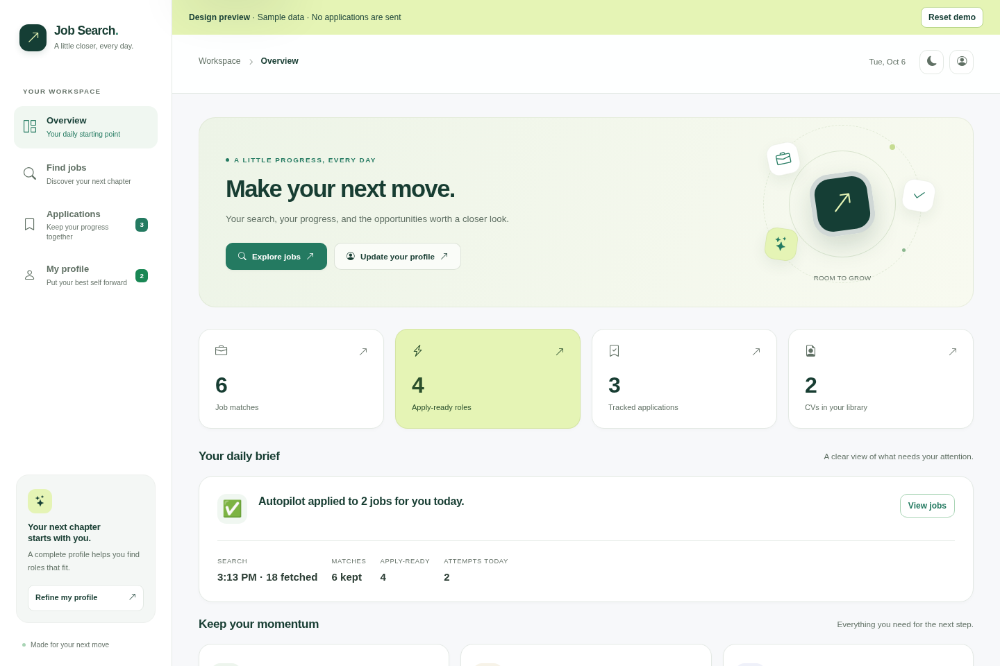
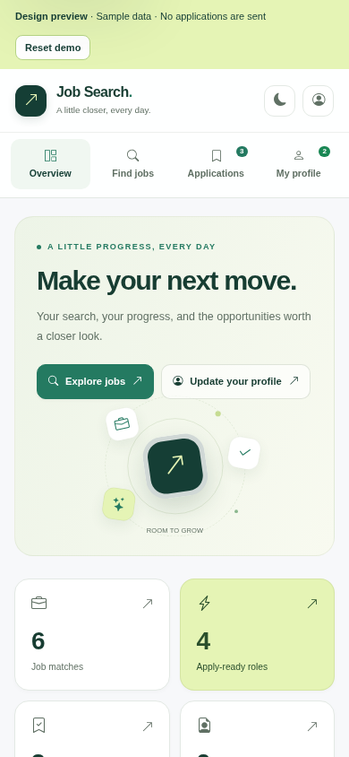

# Job Search App

[](https://github.com/coquito29/job-search-app/actions/workflows/tests.yml)

A personal job-search workspace for finding relevant roles, organizing CVs,
and keeping applications moving. Built with Flask, Apify, and an optional
Chrome extension for rule-based autofill and desktop autopilot.

[Live app](https://job-search-app-9pnx.onrender.com/) ·
[Interactive design preview](https://job-search-design-preview-coquito29.bright-bay-6288.chatgpt.site) ·
[Design changes — PR #22](https://github.com/coquito29/job-search-app/pull/22)

The live app uses the real backend. The design preview is private to the owner,
uses fictional sample jobs, and never sends applications. The screenshots below
show the modern workspace redesign in PR #22; merging it into `main` makes it
available to the Render deployment.



<details>
<summary>See the mobile layout</summary>



</details>

## What it does

- Searches job boards through Apify and ranks results against the saved profile.
- Keeps a CV library, application tracker, follow-up list, and cover-letter
  drafts in one place.
- Provides a daily digest and an optional desktop Chrome extension that fills
  supported application forms. With autopilot enabled, the extension can also
  submit eligible applications and report jobs that need attention.
- Offers Overview, Find jobs, Applications, and My profile pages, with responsive
  layouts, dark mode, and animations that respect reduced-motion preferences.
- Works without an AI provider: matching and autofill use local rules.

## Run locally

1. Install Python 3.10+ and the dependencies:

   ```bash
   pip install -r requirements.txt
   ```

2. Start the app:

   ```bash
   python app.py
   ```

3. Open the local address printed by Flask. Add an Apify token in **My profile** to
   search for jobs.

The app uses a local `applications.db` file by default. Set `DATABASE_URL` to
use Postgres in a hosted environment.

## Test

```bash
python run_tests.py
```

For a fresh checkout, install the extension test dependency once:

```bash
cd chrome-extension/tests
npm ci
```

## Project layout

| Path | Purpose |
| --- | --- |
| `app.py` | Flask routes and the current application orchestration layer |
| `billing.py` | Subscription and quota helpers |
| `location_filter.py` | US work-eligibility location classification |
| `work_history.py` | Work-history normalization |
| `templates/` and `static/` | Web interface and PWA assets |
| `chrome-extension/` | Optional rule-based browser autofill extension |

## Privacy and safety

Do not commit CVs, cover letters, API tokens, databases, or any personal
contact information to a public repository. Keep the repository private when
it contains personal job-search data, and use local, ignored files for those
materials. Check your saved profile and application queue before enabling
autopilot, and inspect the reported results and jobs needing review.

## Deployment

The Flask service is configured for Render through `Procfile`. Configure
production secrets as environment variables rather than checking them into the
repository. Render deploys the app from `main`; a GitHub pull request does not
update the live app until it is merged and the deployment succeeds. GitHub Pages
can host static pages but cannot run this Flask backend.

The Chrome extension requires desktop Chrome, is loaded separately from a local
checkout, and needs a reload after extension changes. Mobile browsers can use
the website; desktop autopilot requires the extension.
